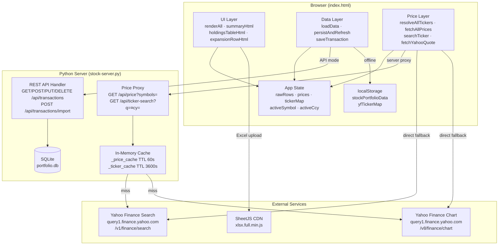
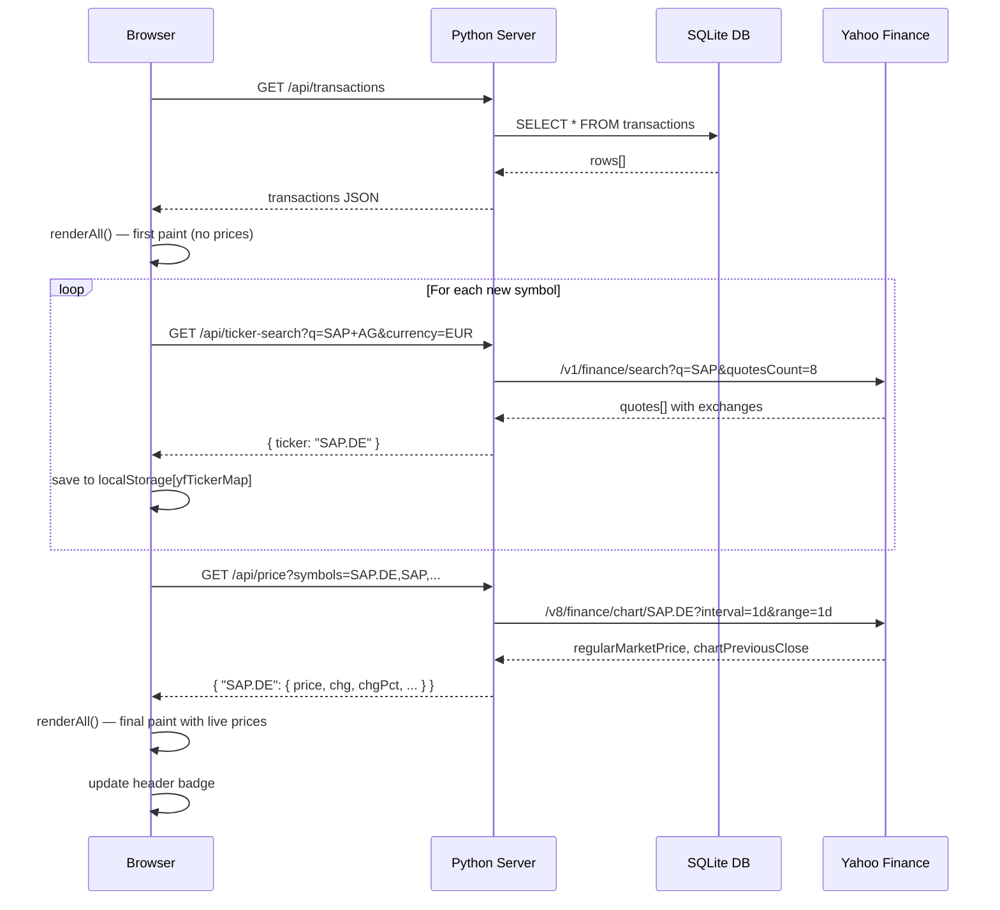
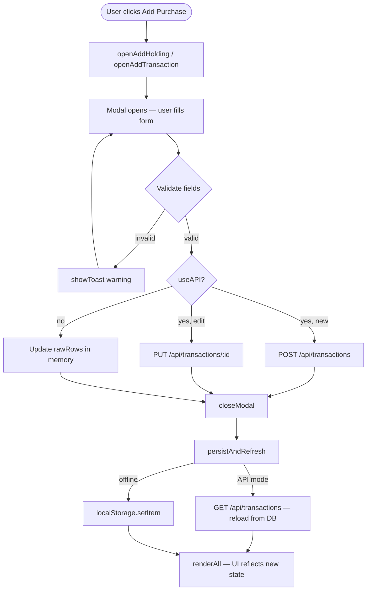

# Portfolio Tracker

A personal stock portfolio tracker built as a single-page web app with an optional local backend server and SQLite database.

## Features

- **Three currency sections** — EUR, USD, and ILS, each with its own summary and holdings table
- **Live market prices** — per-symbol prices fetched from Yahoo Finance, with automatic ticker resolution
- **Live FX rates** — EUR/ILS and USD/ILS exchange rates displayed next to each section header, sourced from Yahoo Finance
- **Per-holding summary** — Total Invested, Current Value, Total Gain/Loss, Overall Return %, Total Shares
- **Transaction drill-down** — click any holding row to expand all individual purchase lots inline
- **Full CRUD** — add, edit, and delete holdings and individual transactions via modal forms
- **Excel import** — upload a `.xlsx` file to replace the portfolio data
- **SQLite database** — when the local server is running, all data persists in `portfolio.db`
- **Offline fallback** — works without the server using browser `localStorage`

---

## Quick Start

### Option A — Open directly in browser (offline mode)

```bash
open index.html
```

Data is saved to `localStorage`. No server required.

### Option B — Run with local server (database mode)

```bash
python3 stock-server.py
```

Then open **http://localhost:8765** in your browser.

Data is persisted in `portfolio.db` (SQLite). The status bar shows `· DB` when connected, or `· offline` when using localStorage.

---

## Component Diagram



---

## Page Load & Price Flow



---

## CRUD Flow



---

## Data Model

### `transactions` table (SQLite)

| Column | Type | Notes |
|--------|------|-------|
| `id` | INTEGER | Primary key, auto-increment |
| `symbol` | TEXT | Internal symbol, e.g. `50724` |
| `name` | TEXT | Display name, e.g. `SAP AG-SPONSORE` |
| `quantity` | REAL | Number of shares |
| `purchase_price` | REAL | Price per share at purchase |
| `purchase_date` | TEXT | ISO date `YYYY-MM-DD` |
| `currency` | TEXT | `EUR` / `USD` / `ILS`, default `EUR` |
| `created_at` | TEXT | Server timestamp on insert |
| `updated_at` | TEXT | Server timestamp on update |

### In-memory structures (client)

| Variable | Shape | Purpose |
|----------|-------|---------|
| `rawRows` | `[symbol, name, qty, price, date, ccy][]` | All transactions |
| `prices` | `{ internalSymbol: { price, chg, chgPct, yfTicker, currency } }` | Live quotes keyed by internal symbol |
| `tickerMap` | `{ internalSymbol: { ticker, name, resolvedAt } }` | Persisted in `localStorage` |

---

## REST API

| Method | Endpoint | Description |
|--------|----------|-------------|
| `GET` | `/api/transactions` | List all transactions |
| `POST` | `/api/transactions` | Add a transaction |
| `PUT` | `/api/transactions/:id` | Update a transaction |
| `DELETE` | `/api/transactions/:id` | Delete a transaction |
| `POST` | `/api/transactions/import` | Bulk replace all transactions |
| `GET` | `/api/ticker-search?q=&currency=` | Resolve stock name to Yahoo ticker |
| `GET` | `/api/price?symbols=A,B` | Live quotes keyed by ticker |
| `GET` | `/` | Serve `index.html` |

### Transaction object

```json
{
  "id": 1,
  "symbol": "50724",
  "name": "SAP AG-SPONSORE",
  "quantity": 5.25,
  "purchase_price": 174.56,
  "purchase_date": "2024-03-06",
  "currency": "EUR",
  "created_at": "2026-08-06 10:00:00",
  "updated_at": "2026-08-06 10:00:00"
}
```

---

## Excel Upload Format

The app expects a sheet named `clean-table` (falls back to the first sheet):

| Stock Symbol | Stock Name | Quantity | Purchase Price | Purchase Date | Currency |
|---|---|---|---|---|---|
| 50724 | SAP AG-SPONSORE | 5.25 | 174.56 | 2024-03-06 | EUR |

`Currency` is optional and defaults to `EUR`. Valid values: `EUR`, `USD`, `ILS`.

---

## Requirements

- A modern web browser (Chrome, Firefox, Safari, Edge)
- Python 3.6+ (only needed for server / database mode)
- No external Python dependencies — stdlib only (`sqlite3`, `http.server`, `urllib`, `gzip`, `threading`)
